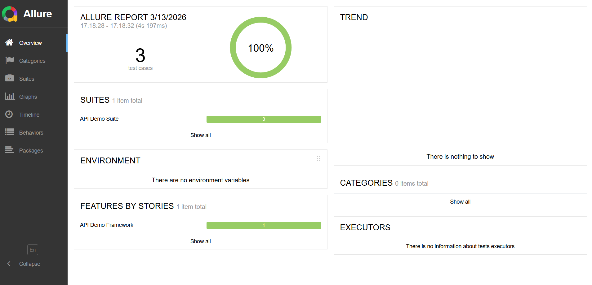
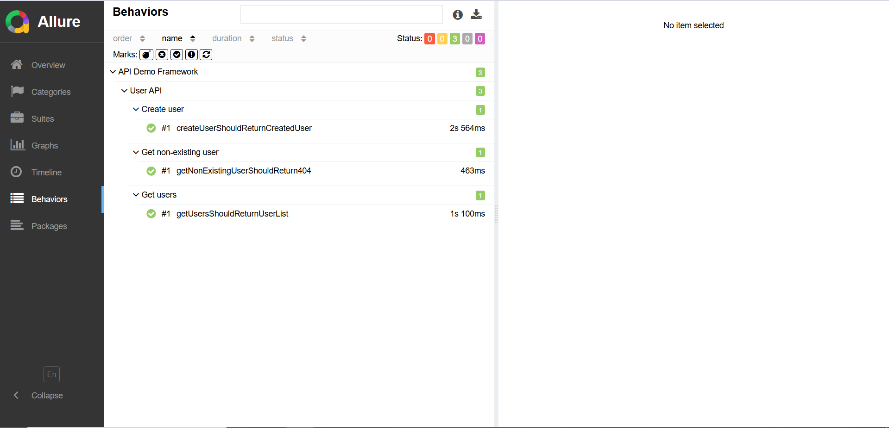

# API Automation Demo Framework


Demo API test automation framework built with Java, REST Assured, TestNG, Maven, and Allure Reports.

This project demonstrates a clean and scalable API automation architecture with:
- reusable request specification
- client layer for endpoint interactions
- DTO-based request and response models
- positive and negative test coverage
- Allure reporting integration

## Tech Stack

- Java 17
- REST Assured
- TestNG
- Maven
- Jackson
- Allure Reports

## Architecture

The framework follows a layered architecture:

Tests → API Client → Request Specification → REST Assured

Key design principles:

• separation of test logic and API interaction  
• reusable request configuration  
• DTO based request/response models  
• centralized configuration

## Project Structure

```text
src
 └── test
     ├── java
     │   ├── base
     │   │   └── BaseTest.java
     │   ├── client
     │   │   ├── ApiClient.java
     │   │   └── UserApiClient.java
     │   ├── models
     │   │   ├── request
     │   │   │   └── CreateUserRequest.java
     │   │   └── response
     │   │       ├── CreateUserResponse.java
     │   │       └── UserResponse.java
     │   ├── tests
     │   │   └── UserApiTest.java
     │   └── utils
     │       └── ConfigReader.java
     └── resources
         ├── allure.properties
         └── config.properties
```

## Test Scenarios

- GET /users → getUsersShouldReturnUserList
- POST /users → createUserShouldReturnCreatedUser
- GET /users/{id} → getNonExistingUserShouldReturn404

## How to Run

Run all tests:

mvn clean test

Generate Allure report:

allure serve target/allure-results

## Reporting

Allure Reports are integrated to provide detailed test execution results including:

• request / response logs  
• test steps  
• failure diagnostics

## Example Reports





## Design Decisions

The framework uses DTO models for request and response bodies to ensure type safety and clean test code.

API interaction is encapsulated inside API client classes to separate test logic from HTTP implementation.